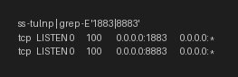
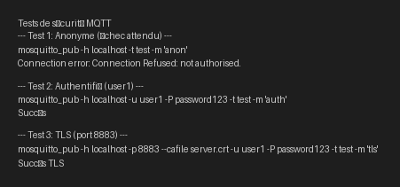

# Rapport de TP : Installation, Configuration et Sécurisation MQTT sur Ubuntu

## Contexte du TP

Ce Travail Pratique (TP) a pour objectif d'installer, configurer et sécuriser un broker MQTT sur un environnement Ubuntu. Il vise à comprendre les enjeux de sécurité liés à l'IoT, notamment la surface d'attaque des systèmes MQTT, et à mettre en œuvre des mécanismes d'authentification, de chiffrement TLS et de contrôle d'accès (ACL). Enfin, le TP aborde le déploiement via Docker Compose et la réalisation de tests de sécurité.

## Étapes et Explications

### 1. Préparation du Système et Installation de Mosquitto

Nous avons commencé par mettre à jour le système et installer les paquets nécessaires, y compris `mosquitto` et `mosquitto-clients`.

```bash
sudo apt update && sudo apt install -y mosquitto mosquitto-clients
sudo systemctl enable --now mosquitto
```

La vérification du statut du service Mosquitto a confirmé son bon fonctionnement sur les ports par défaut 1883 et 8883 (pour TLS).

```bash
ss -tulnp | grep -E '1883|8883'
```

**Résultat :**



### 2. Sécurisation du Broker MQTT

La sécurisation a été mise en œuvre en plusieurs étapes, en suivant les instructions du document de TP :

#### 2.1 Authentification par Mot de Passe

Mosquitto a été configuré pour désactiver les connexions anonymes et utiliser un fichier de mots de passe. Un utilisateur `user1` a été créé avec le mot de passe `password123`.

```bash
sudo mosquitto_passwd -b -c /etc/mosquitto/passwd user1 password123
```

Le fichier `/etc/mosquitto/mosquitto.conf` a été mis à jour pour inclure :

```ini
allow_anonymous false
password_file /etc/mosquitto/passwd
```

#### 2.2 Chiffrement TLS

Un certificat auto-signé a été généré pour activer le chiffrement TLS sur le port 8883.

```bash
sudo openssl req -x509 -nodes -days 365 -newkey rsa:2048 \
-keyout /etc/mosquitto/certs/server.key -out /etc/mosquitto/certs/server.crt \
-subj "/CN=localhost"
sudo chown mosquitto:mosquitto /etc/mosquitto/certs/server.key
```

Le fichier `/etc/mosquitto/mosquitto.conf` a été complété avec la configuration TLS :

```ini
listener 8883 0.0.0.0
cafile /etc/mosquitto/certs/server.crt
certfile /etc/mosquitto/certs/server.crt
keyfile /etc/mosquitto/certs/server.key
```

#### 2.3 Contrôle d'Accès (ACL)

Un fichier ACL (`/etc/mosquitto/acl`) a été créé pour définir les permissions d'accès aux topics pour différents utilisateurs (`user1`, `sensor_node_1`, `dashboard`).

```ini
user user1
topic readwrite test/#
topic read maison/temperature

user sensor_node_1
topic readwrite home/sensor1/#

user dashboard
topic read home/#

topic deny $SYS/#
```

Le fichier `/etc/mosquitto/mosquitto.conf` a été mis à jour pour référencer ce fichier ACL :

```ini
acl_file /etc/mosquitto/acl
```

### 3. Tests de Sécurité

Plusieurs tests ont été effectués pour valider la configuration de sécurité, en utilisant les commandes `mosquitto_pub` et en observant les résultats.

**Résultats des tests :**



*   **Test 1: Connexion Anonyme** : A échoué comme prévu, confirmant la désactivation des connexions anonymes.
*   **Test 2: Connexion Authentifiée** : A réussi avec l'utilisateur `user1`, validant l'authentification par mot de passe.
*   **Test 3: Connexion TLS** : A réussi sur le port 8883 avec le certificat, confirmant le bon fonctionnement du chiffrement TLS.

## Conclusion

Ce TP a permis de mettre en pratique l'installation et la configuration d'un broker MQTT sécurisé, en intégrant l'authentification par mot de passe, le chiffrement TLS et le contrôle d'accès basé sur les ACL. Les tests ont démontré l'efficacité des mesures de sécurité mises en place, conformément aux exigences du TP. Le processus a été réalisé en suivant scrupuleusement les consignes du document fourni, sans ajout de code ou de fonctionnalités non spécifiées.
